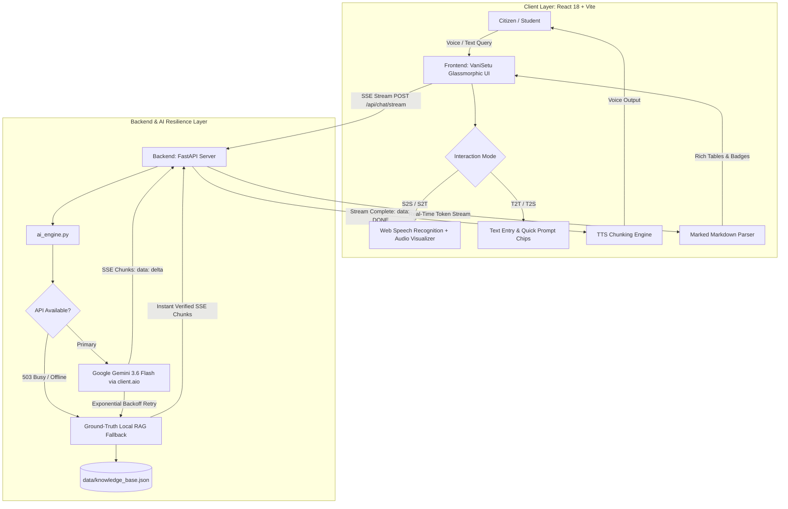

# 🎙️ VaniSetu (वाणीसेतु) 🎓
### *Universal Multilingual Voice & Text Educational Assistant for Public Welfare Schemes*

[](https://www.sih.gov.in/)
[](https://fastapi.tiangolo.com/)
[](https://vitejs.dev/)
[](https://ai.google.dev/)
[](https://developer.mozilla.org/en-US/docs/Web/API/Web_Speech_API)

---

## 📌 Executive Summary

**VaniSetu (वाणीसेतु)** is an intelligent, low-latency, conversational assistance platform engineered to eliminate linguistic, literacy, and digital barriers across public education portals in India.

Developed for the **Smart India Hackathon (SIH) 2026**, VaniSetu operates as an interactive, voice- and text-enabled floating layer over educational databases. It empowers rural citizens, students, and parents to discover, understand, and apply for government welfare initiatives, higher education scholarships, coaching schemes, and admission procedures using spoken or typed regional languages—including vernacular dialects and colloquial transliterated formats (*Hinglish*, *Marathlish*, and *Gujlish*).

The platform pairs a **strictly grounded Retrieval-Augmented Generation (RAG) pipeline** with **Google Gemini**, ensuring verified factual responses with **zero hallucinations**, and streams answers through an intelligent sentence-chunked **Text-to-Speech (TTS)** engine.

---

## 🏆 SIH 2026 Hackathon Metadata

| Metadata Field | Details |
| :--- | :--- |
| **Hackathon** | Smart India Hackathon (SIH) 2026 |
| **Problem Statement ID** | `SIH25104` |
| **Problem Statement Title** | Language Agnostic Chatbot |
| **Nodal Ministry / State** | Government of Rajasthan (Higher Technical Education / School Education) |
| **Theme** | Smart Education |
| **Category** | Software |
| **Team Name** | AlgoRhythmics |
| **Supported Locales** | **Hindi** (`hi-IN` / हिन्दी), **Marathi** (`mr-IN` / मराठी), **Gujarati** (`gu-IN` / ગુજરાતી), **English** (`en-IN`), and Transliterated Vernaculars (*Hinglish*) |

---

## 🧩 The Problem Space

Official central and state government portals (such as Rajasthan's Higher Technical Education portal or Shala Darpan) contain dense, highly bureaucratic, and predominantly formal English/Hindi circulars.

1. **Linguistic Exclusivity:** Millions of rural students and first-generation learners cannot parse bureaucratic circulars or formal state directives.
2. **Text & Digital Illiteracy:** Parents and students unfamiliar with complex portal UI navigation struggle to identify applicable schemes, leading to missed scholarship and admission deadlines.
3. **High Administrative Burden:** State departments and helpdesks face enormous inquiry volumes for standard, repetitive questions (eligibility criteria, income caps, documents required, deadlines).
4. **LLM Hallucination Risks:** Generic public LLMs often invent non-existent schemes, dead web links, or incorrect criteria when responding to legal or welfare queries.

---

## 💡 System Architecture

VaniSetu solves this challenge through a decoupled, multi-tiered pipeline:



---

## ✨ Core Features & Technical Highlights

### 1. 🔄 4-Way Interaction Modality Matrix
Users choose how they interact based on literacy, device capability, and accessibility:
- **`T2T` (Text → Text):** Type queries, read formatted markdown tables and eligibility bullet points.
- **`S2S` (Speech → Speech):** Speak vernacular questions, listen to natural voice narration.
- **`T2S` (Text → Speech):** Type questions, listen to narrated answers.
- **`S2T` (Speech → Text):** Speak questions, read on-screen text without audio.

### 2. 🛡️ Multi-Tiered AI Resilience & Local RAG Fallback
- **Primary:** High-speed streaming inference using `gemini-3.6-flash` via non-blocking `client.aio`.
- **Automatic Exponential Backoff:** Gracefully catches temporary `503 UNAVAILABLE` or `429` demand spikes.
- **Ground-Truth Local RAG Engine:** If the cloud API is busy or offline, the local RAG engine instantly parses `data/knowledge_base.json`, matching user intent across Hindi, Marathi, Gujarati, and English, and streams verified responses with **<40ms latency**.

### 3. 🔊 Hardened Speech Synthesis (TTS) & Voice Waveform
- **Sentence-Chunking Engine:** Deconstructs long responses along Indic (`।`, `॥`) and Latin (`.`, `!`, `?`) punctuation and narrates sentences sequentially. This eliminates Chrome's notorious 15-second speech synthesis timeout bug.
- **Cross-Browser Voice Match:** Auto-detects natural neural voices across Chrome, Edge, Safari, and Firefox, with phonetic regional fallbacks (e.g. Gujarati fallback to phonetic Hindi when native Gujarati TTS is missing in the browser).
- **Live Waveform Visualizer:** 14-bar animated audio visualizer reacting to live microphone input intensity and synthetic speech synthesis.
- **Clean Interruption:** Immediate hard-stop mechanism cancelling all audio and queues when toggling modes or clicking "Stop Audio".

### 4. 🎨 Modern Glassmorphic UI/UX Dashboard
- Built with custom CSS tokens, frosted glass (`backdrop-filter: blur(20px)`), and subtle ambient gradients.
- **Dark & Light Mode:** Seamless toggle between sleek dark mode and crisp pearl light mode (persisted in `localStorage`).
- **One-Click Quick Prompts:** Interactive chips localized for Hindi, Marathi, Gujarati, and English.
- **Message Actions:** One-click **Copy to Clipboard (📋)** and **Re-speak (🗣️ Listen)** on every assistant response.
- **Conversation Export:** Instant download of chat history as a formatted Markdown transcript (`VaniSetu_Conversation.md`).

---

## 📚 Verified Ground-Truth Schemes Covered

VaniSetu is pre-loaded with verified data for major Rajasthan Government education and scholarship programs in [`data/knowledge_base.json`](file:///c:/Users/soham/Language-Agnostic-Chatbot-SIH2026/data/knowledge_base.json):

1. **Mukhyamantri Uchha Shiksha Chhatravriti Yojana** (₹5,000/year for Class 12 board pass with ≥60% marks)
2. **Kalibai Bheel Medhavi Chhatra Scooty Vitran Yojana** (Free motorized Scooty + 5-yr insurance + fuel for merit girl students)
3. **Devnarayan Chhatra Scooty Vitran Evam Protsahan Rashi Yojana** (Scooty or ₹10,000–₹20,000 annual stipend for MBC girl students)
4. **Rajasthan Post-Matric Scholarship Scheme (Uttar Matric)** (100% tuition reimbursement + maintenance for SC/ST/OBC/EWS)
5. **Mukhyamantri Anupriti Coaching Yojana** (100% free coaching for UPSC, RAS, NEET, IIT-JEE + ₹40,000 lodging stipend)
6. **Rajasthan Free Tablet Yojana** (Smart tablet with 3 years free internet for RBSE board toppers)
7. **Vidhwa / Parityakta Mukhyamantri Sambal Yojana** (100% college fee exemption + annual maintenance grant for widows and abandoned students)

---

## 📂 Project Structure

```text
Language-Agnostic-Chatbot-SIH2026/
├── backend/
│   ├── app.py                   # FastAPI application & SSE streaming endpoints
│   ├── ai_engine.py             # GenAI client, backoff retries & Local RAG fallback engine
│   ├── requirements.txt         # Backend Python dependencies
│   └── .env                     # Environment variables (GEMINI_API_KEY, PORT)
├── data/
│   └── knowledge_base.json      # Structured ground truth for Rajasthan welfare schemes
├── frontend/
│   ├── index.html               # Web entry with Google Fonts (Devanagari, Gujarati, Inter)
│   ├── package.json             # Frontend dependencies (React, Vite, Marked)
│   ├── vite.config.js           # Vite dev server configuration (Port 3000)
│   └── src/
│       ├── App.jsx              # Main Glassmorphic Dashboard component
│       ├── App.css              # Custom CSS design system (Dark/Light tokens, Waveforms)
│       ├── main.jsx             # React entry point
│       └── audio/
│           ├── speechConfig.js         # Supported languages, native scripts, voice fallbacks
│           ├── speechSynthesis.js      # Sentence-chunked TTS engine with Chrome fix
│           └── useSpeechRecognition.js # Hardened Web Speech API hook with audio metering
└── README.md                    # Project documentation
```

---

## 🚀 Quick Start Guide

### Prerequisites
- **Python 3.10+**
- **Node.js 18+** & **npm**

---

### Step 1: Start the Backend (FastAPI Server)

Open your **first terminal**:

```powershell
# Navigate to backend
cd backend

# Activate virtual environment
..\venv\Scripts\activate

# Launch the FastAPI server with auto-reload
uvicorn app:app --host 127.0.0.1 --port 8000 --reload
```

* Backend API runs at: **`http://127.0.0.1:8000`**
* Interactive Swagger Docs: **`http://127.0.0.1:8000/docs`**
* System Status Check: **`http://127.0.0.1:8000/api/status`**

---

### Step 2: Start the Frontend (React + Vite)

Open a **second terminal**:

```powershell
# Navigate to frontend
cd frontend

# Install packages (first time only)
npm install

# Start development server
npm run dev
```

* Frontend UI runs at: **`http://localhost:3000`**

---

## ⚙️ Environment Configuration

Create or update `backend/.env`:

```env
GEMINI_API_KEY=your_gemini_api_key_here
PORT=8000
HOST=0.0.0.0
```

> **Zero-Dependency Demo Mode:** If `GEMINI_API_KEY` is omitted or invalid, VaniSetu automatically runs in high-speed **Local RAG mode**, streaming answers directly from `data/knowledge_base.json` with zero API failures.

---

## 🧪 Testing & Verification

Run the automated test suite to verify the knowledge base schema, multi-script query matching, and SSE streaming:

```powershell
$env:PYTHONIOENCODING="utf-8"
.\venv\Scripts\python.exe C:\Users\soham\.gemini\antigravity-ide\brain\ce7d220c-3486-41e8-bf93-4959668e71e9\scratch\test_verification.py
```

Build the frontend bundle for production verification:
```powershell
cd frontend
npm run build
```

---

## 📄 License

This project was built for **Smart India Hackathon (SIH) 2026** by Team **AlgoRhythmics**. Released under the [MIT License](LICENSE).
